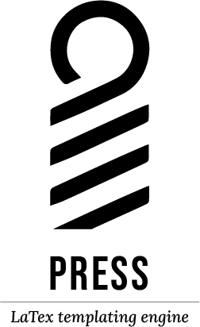

# Printing Press

</img>

Printing Press allows to to quickly apply different latex templates to your documents.
Press automatically converts and organizes your plain text (txt, md, rst) and compiles.
All latex compilation is done in a temporary directory that is cleaned after the pdf is produced
You only left with the main.pdf, just as God intended.

#### Contents
  - [Installation](#installation)
  - [Features](#features)
  - [Usage](#basic-usage)
    
# Installation
```bash
# macOS or Linux
brew tap antonio-leitao/taps
brew install press
```

# Features
- Save latex templates in only one place instead of creating multiple instances.
- Clean your working directory by only having the content.
- Experiment with different templates instantaneously.

# Basic Usage
Save LateX templates in `.press/themes` so that they dont clog up your content diretory.
When you are ready to compile just run

```bash
press <theme> [options]
```
The options for each theme are dynamically read from the file `.press/themes/theme_name/variables.tex`.
You can use comments to add variable descriptions.
Currently only supports text and boolean variables.

```tex
\newcommand{\authorname}{Default Name} %Author name
\newcommand{\booktitle}{Default Template Title} %Descrption of title variable
\newif\ifisdraft %Description of Boolean Variable
\newcommand{\subtitle}{Your Book’s Subtitle} %Book subtitle (if any)
```

You can quickly view the options for your theme my running `press [theme] --help`.
For example the previous `variable.tex` would result in 

```shell
> press book --help
Applies the book template

Arguments:
  --authorname   Author name
  --booktitle    Description of title variable
  --subtitle     Book subtitle (if any)

Flags:
  --isdraft   Description of Boolean Variable
```

Allowing you to use the `book` template like so:

```bash
press book --booktitle "My Memoires" --authorname "My & Myself"
```
